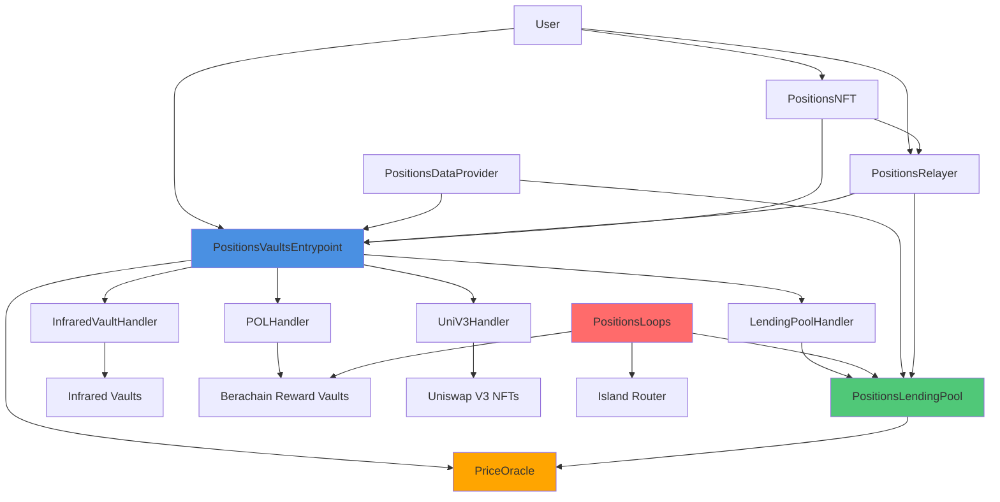

# Positions Finance Protocol - Technical Documentation

## Overview

Positions Finance is a decentralized protocol that enables asset rehypothecation and leveraged positions across multiple chains (Arbitrum, Berachain, and Monad). The protocol allows users to:

- **Deposit assets** into various vaults and earn rewards
- **Use deposited assets as collateral** to borrow against them
- **Open leveraged positions** using borrowed funds
- **Cross-chain operations** through NFT-based proof of collateral

The protocol uses a modular architecture with handlers for different vault types, a centralized entrypoint for user interactions, and a lending pool for borrowing/lending operations.

## Architecture Overview



## Core Components

### 1. PositionsVaultsEntrypoint

The main entry point for all vault operations. Users interact with this contract to deposit, withdraw, and manage their positions across different vault handlers.

### 2. PositionsLendingPool

A lending pool inspired by Aave V2 that allows users to supply assets for lending and borrow against their NFT-collateralized positions. Features dynamic interest rates based on utilization.

### 3. PositionsLoops

Enables users to open leveraged positions by borrowing from the lending pool and providing liquidity to AMM pools (e.g., Kodiak Island on Berachain).

### 4. Vault Handlers

Modular handlers that manage interactions with different vault types:
- **LendingPoolHandler**: Wraps the lending pool for use as a vault
- **InfraredVaultHandler**: Manages Infrared protocol vaults
- **POLHandler**: Handles Berachain Proof-of-Liquidity reward vaults
- **UniV3Handler**: Manages Uniswap V3 NFT positions as collateral

### 5. PriceOracle

Centralized oracle that fetches token prices from Pyth Network and supports custom price feeds for assets without Pyth feeds.

### 6. PositionsDataProvider

Utility contract that aggregates user balances across all vaults and handlers.

### 7. PositionsRelayer (POC)

Cross-chain relayer that processes collateral requests and manages NFT ownership verification across chains.

### 8. PositionsNFT (POC)

ERC721 NFT that serves as proof of collateral for cross-chain operations. Each user receives one NFT that represents their position.

---

## Contract Documentation

### PositionsVaultsEntrypoint

**Purpose**: Single entry point for depositing and withdrawing from various supported vaults.

#### Public Functions

##### `initialize(address _admin, address _upgrader, address _relayer)`
- **Purpose**: Initializes the contract with admin, upgrader, and relayer addresses
- **Inputs**:
  - `_admin`: Admin address (gets DEFAULT_ADMIN_ROLE)
  - `_upgrader`: Upgrader address (gets UPGRADER_ROLE)
  - `_relayer`: Positions relayer contract address
- **Returns**: None
- **Access**: Initializer (can only be called once)

##### `setPositionsRelayer(address _newRelayer)`
- **Purpose**: Updates the relayer address (admin only)
- **Inputs**:
  - `_newRelayer`: New relayer address
- **Returns**: None
- **Access**: DEFAULT_ADMIN_ROLE

##### `addHandler(address _handler)`
- **Purpose**: Adds a new vault handler to the supported handlers list
- **Inputs**:
  - `_handler`: Handler contract address
- **Returns**: None
- **Access**: DEFAULT_ADMIN_ROLE

##### `removeHandler(address _handler)`
- **Purpose**: Removes a handler from the supported handlers list
- **Inputs**:
  - `_handler`: Handler contract address to remove
- **Returns**: None
- **Access**: DEFAULT_ADMIN_ROLE

##### `deposit(address _handler, address _token, uint256 _amount, uint256 _tokenId, bytes calldata _additionalData)`
- **Purpose**: Deposits tokens into a supported vault handler
- **Inputs**:
  - `_handler`: Vault handler address
  - `_token`: Token address to deposit
  - `_amount`: Amount of tokens to deposit
  - `_tokenId`: User's NFT tokenId (proof of collateral)
  - `_additionalData`: Handler-specific data (encoded vault address, etc.)
- **Returns**: None
- **Access**: Public

##### `queueWithdraw(address _handler, address _token, uint256 _amount, uint256 _tokenId, bytes32[] calldata _proof, bytes calldata _additionalData)`
- **Purpose**: Queues a withdrawal request from a vault
- **Inputs**:
  - `_handler`: Vault handler address
  - `_token`: Token address to withdraw
  - `_amount`: Amount of tokens to withdraw
  - `_tokenId`: User's NFT tokenId
  - `_proof`: Merkle proof to verify NFT ownership
  - `_additionalData`: Handler-specific data
- **Returns**: `bytes32` requestId
- **Access**: Public

##### `completeWithdraw(address _handler, bytes32 _requestId, bytes32[] calldata _proof, bytes calldata _additionalData)`
- **Purpose**: Completes a withdrawal after the request is approved by the relayer
- **Inputs**:
  - `_handler`: Vault handler address
  - `_requestId`: Withdrawal request ID
  - `_proof`: Merkle proof to verify NFT ownership
  - `_additionalData`: Handler-specific data
- **Returns**: None
- **Access**: Public

##### `liquidate(address _handler, address _token, uint256 _amount, uint256 _tokenId, address _liquidator, bytes calldata _additionalData)`
- **Purpose**: Liquidates an unhealthy position (relayer only)
- **Inputs**:
  - `_handler`: Vault handler address
  - `_token`: Token address to liquidate
  - `_amount`: Amount to liquidate
  - `_tokenId`: User's NFT tokenId
  - `_liquidator`: Liquidator address
  - `_additionalData`: Handler-specific data
- **Returns**: None
- **Access**: RELAYER_ROLE

##### `completeLiquidation(address _handler, uint256 _tokenId, bytes calldata _additionalData)`
- **Purpose**: Completes liquidation for vaults with withdrawal delays
- **Inputs**:
  - `_handler`: Vault handler address
  - `_tokenId`: User's NFT tokenId
  - `_additionalData`: Handler-specific data
- **Returns**: None
- **Access**: Public

##### `setWithdrawalStatus(bytes32[] memory _requestIds, Status[] memory _statuses)`
- **Purpose**: Approves or rejects withdrawal requests (relayer only)
- **Inputs**:
  - `_requestIds`: Array of withdrawal request IDs
  - `_statuses`: Array of statuses (ACCEPTED/REJECTED)
- **Returns**: None
- **Access**: RELAYER_ROLE

##### `getSupportedHandlers()`
- **Purpose**: Returns all supported vault handlers
- **Inputs**: None
- **Returns**: `address[]` array of handler addresses
- **Access**: Public view

---

### PositionsLendingPool

**Purpose**: Lending pool that allows users to supply assets for lending and borrow against NFT-collateralized positions with dynamic interest rates.

#### Public Functions

##### `initialize(address _admin, address _positionsRelayer, address _priceOracle, uint256 _initialReserveFactor)`
- **Purpose**: Initializes the lending pool
- **Inputs**:
  - `_admin`: Admin address
  - `_positionsRelayer`: Positions relayer address
  - `_priceOracle`: Price oracle contract address
  - `_initialReserveFactor`: Initial reserve factor in basis points (bps)
- **Returns**: None
- **Access**: Initializer

##### `setPositionsRelayer(address _newRelayer)`
- **Purpose**: Updates the positions relayer address
- **Inputs**:
  - `_newRelayer`: New relayer address
- **Returns**: None
- **Access**: Owner only

##### `setOracle(address _newOracle)`
- **Purpose**: Updates the price oracle address
- **Inputs**:
  - `_newOracle`: New oracle address
- **Returns**: None
- **Access**: Owner only

##### `updateReserveFactor(uint256 _newReserveFactor)`
- **Purpose**: Updates the reserve factor (protocol fee on interest)
- **Inputs**:
  - `_newReserveFactor`: New reserve factor in bps (must be < 10000)
- **Returns**: None
- **Access**: Owner only

##### `setTreasury(address _newTreasury)`
- **Purpose**: Sets the treasury address (recipient of protocol fees)
- **Inputs**:
  - `_newTreasury`: Treasury address
- **Returns**: None
- **Access**: Owner only

##### `setLoops(address _loops)`
- **Purpose**: Adds a loops contract address
- **Inputs**:
  - `_loops`: Loops contract address
- **Returns**: None
- **Access**: Owner only

##### `createLendingPool(address _asset, InterestRateModel calldata _interestRateModel)`
- **Purpose**: Creates a new lending pool for an asset
- **Inputs**:
  - `_asset`: Asset address
  - `_interestRateModel`: Interest rate model parameters (baseRate, slope1, slope2, optimalUtilization)
- **Returns**: None
- **Access**: Owner only

##### `updateLendingPoolInterestRateModel(address _asset, InterestRateModel calldata _interestRateModel)`
- **Purpose**: Updates the interest rate model for an existing pool
- **Inputs**:
  - `_asset`: Asset address
  - `_interestRateModel`: New interest rate model
- **Returns**: None
- **Access**: Owner only

##### `supply(address _asset, uint256 _amount, address _for)`
- **Purpose**: Supplies assets to the lending pool to earn interest
- **Inputs**:
  - `_asset`: Asset address to supply
  - `_amount`: Amount to supply
  - `_for`: Address to open the supply position for
- **Returns**: None
- **Access**: Public

##### `withdraw(address _asset, uint256 _amount, address _to)`
- **Purpose**: Withdraws supplied assets with accrued interest
- **Inputs**:
  - `_asset`: Asset address to withdraw
  - `_amount`: Amount to withdraw
  - `_to`: Address to receive the withdrawal
- **Returns**: None
- **Access**: Public

##### `borrowRequest(PositionsCollateralRequest memory _collateralRequest, bytes memory _signature)`
- **Purpose**: Creates a borrow request that will be processed by the relayer
- **Inputs**:
  - `_collateralRequest`: Collateral request details (protocol, token, amount, tokenId, owner, deadline)
  - `_signature`: Signature for request verification
- **Returns**: `bytes32` requestId
- **Access**: Public

##### `fullfillCollateralRequest(bytes32 _requestId)`
- **Purpose**: Fulfills a borrow request (called by relayer)
- **Inputs**:
  - `_requestId`: Borrow request ID
- **Returns**: None
- **Access**: Relayer only

##### `borrowForLoops(address _token, uint256 _amount)`
- **Purpose**: Borrows tokens for the loops contract
- **Inputs**:
  - `_token`: Token address to borrow
  - `_amount`: Amount to borrow
- **Returns**: None
- **Access**: Loops contract only

##### `repayDebt(address _asset, uint256 _amount, uint256 _tokenId)`
- **Purpose**: Repays borrowed debt
- **Inputs**:
  - `_asset`: Asset address to repay
  - `_amount`: Amount to repay (will repay full debt if amount exceeds debt)
  - `_tokenId`: NFT tokenId associated with the borrow position
- **Returns**: None
- **Access**: Public

##### `accrueInterest(address _asset)`
- **Purpose**: Manually accrue interest for a pool (updates indices)
- **Inputs**:
  - `_asset`: Asset address
- **Returns**: None
- **Access**: Public

##### `getSupportedAssets()`
- **Purpose**: Returns all supported assets
- **Inputs**: None
- **Returns**: `address[]` array of asset addresses
- **Access**: Public view

##### `getCurrentSupplyAndBorrowIndex(address _asset)`
- **Purpose**: Gets current supply and borrow indices
- **Inputs**:
  - `_asset`: Asset address
- **Returns**: 
  - `uint256` supplyIndex
  - `uint256` borrowIndex
- **Access**: Public view

##### `getBorrowRequestIds(uint256 _tokenId, address _asset)`
- **Purpose**: Gets all borrow request IDs for a user's NFT and asset
- **Inputs**:
  - `_tokenId`: NFT tokenId
  - `_asset`: Asset address
- **Returns**: `bytes32[]` array of request IDs
- **Access**: Public view

##### `getborrowerDebt(address _asset, uint256 _tokenId)`
- **Purpose**: Gets the total debt (with interest) for a borrower
- **Inputs**:
  - `_asset`: Asset address
  - `_tokenId`: NFT tokenId
- **Returns**: `uint256` total debt
- **Access**: Public view

##### `getAccruedLenderInterest(address _asset, address _lender)`
- **Purpose**: Gets accrued interest for a lender
- **Inputs**:
  - `_asset`: Asset address
  - `_lender`: Lender address
- **Returns**: `uint256` accrued interest
- **Access**: Public view

##### `utilization(uint256 _tokenId)`
- **Purpose**: Gets total borrowed amount in USD (e6 denomination) for a user's NFT
- **Inputs**:
  - `_tokenId`: NFT tokenId
- **Returns**: `uint256` total borrowed in USD
- **Access**: Public view

##### `getReserveData(address _asset)`
- **Purpose**: Gets comprehensive reserve data for an asset
- **Inputs**:
  - `_asset`: Asset address
- **Returns**: `ReserveData` struct containing:
  - `totalLiquidity`: Total supplied liquidity
  - `availableLiquidity`: Available liquidity for borrowing
  - `totalBorrows`: Total borrowed amount
  - `reserveFactor`: Reserve factor in bps
  - `baseRate`, `slope1`, `slope2`, `optimalUtilization`: Interest rate model params
  - `lastUpdateTimestamp`: Last interest accrual timestamp
  - `supplyIndex`, `borrowIndex`: Current indices
  - `supplyRate`, `borrowRate`: Current interest rates
  - `utilization`: Current utilization ratio
- **Access**: Public view

##### `getBalanceWithInterestAccrossAllAssets(address _supplier)`
- **Purpose**: Gets user's balance with interest across all assets
- **Inputs**:
  - `_supplier`: Supplier address
- **Returns**: `SupplierData[]` array containing asset and balance with interest
- **Access**: Public view

---

### PositionsLoops

**Purpose**: Enables users to open leveraged positions by borrowing from the lending pool and providing liquidity to AMM pools.

#### Public Functions

##### `initialize(address _admin, address _positionsRelayer, address _lendingPool, address _islandRouter, address _island, address _swapRouter, address _vault, address _bgt)`
- **Purpose**: Initializes the loops contract
- **Inputs**:
  - `_admin`: Admin address
  - `_positionsRelayer`: Positions relayer address
  - `_lendingPool`: Lending pool address
  - `_islandRouter`: Island router address (for AMM operations)
  - `_island`: Island pool address
  - `_swapRouter`: Swap router address
  - `_vault`: Reward vault address
  - `_bgt`: BGT token address
- **Returns**: None
- **Access**: Initializer

##### `requestOpenLeveragedPosition(uint256 _tokenId, address _borrowToken, uint256 _amount, uint256 _minSwapAmountOut, bool _zeroForOne, bytes memory _routeData, uint256 _minLpTokensToReceive, uint160 _maxSlippage, bytes32[] memory _proof)`
- **Purpose**: Requests to open a leveraged position
- **Inputs**:
  - `_tokenId`: User's NFT tokenId
  - `_borrowToken`: Token to borrow
  - `_amount`: Amount to borrow
  - `_minSwapAmountOut`: Minimum swap output amount
  - `_zeroForOne`: Swap direction
  - `_routeData`: Swap route data
  - `_minLpTokensToReceive`: Minimum LP tokens to receive
  - `_maxSlippage`: Maximum slippage tolerance
  - `_proof`: Merkle proof for NFT ownership
- **Returns**: None
- **Access**: Public

##### `setRequestStatus(bytes32[] memory _requestIds, Status[] memory _statuses)`
- **Purpose**: Sets the status of leverage position requests (relayer only)
- **Inputs**:
  - `_requestIds`: Array of request IDs
  - `_statuses`: Array of statuses
- **Returns**: None
- **Access**: RELAYER_ROLE

##### `openLeveragedPosition(bytes32 _requestId, bytes32[] memory _proof)`
- **Purpose**: Opens a leveraged position after request is accepted
- **Inputs**:
  - `_requestId`: Request ID
  - `_proof`: Merkle proof for NFT ownership
- **Returns**: None
- **Access**: Public

##### `closeLeveragedPosition(CloseParams memory _params)`
- **Purpose**: Closes a leveraged position
- **Inputs**:
  - `_params`: CloseParams struct containing:
    - `tokenId`: NFT tokenId
    - `token`: Token address
    - `buffer`: Additional token amount for repayment
    - `amountLpTokens`: LP tokens to withdraw
    - `proof`: Merkle proof
    - `amountTokenMin`, `amountOtherTokenMin`: Minimum amounts out
    - `minSwapAmountOut`: Minimum swap output
    - `fee`: Swap fee
    - `deadline`: Transaction deadline
    - `sqrtPriceLimitX96`: Price limit for swap
- **Returns**: None
- **Access**: Public (or relayer for liquidations)

##### `redeemBGTForBera(uint256 _tokenId, bytes32[] calldata _proof)`
- **Purpose**: Redeems BGT rewards for Bera native token
- **Inputs**:
  - `_tokenId`: User's NFT tokenId
  - `_proof`: Merkle proof for NFT ownership
- **Returns**: None
- **Access**: Public

##### `earned(address _rewardVault, uint256 _tokenId)`
- **Purpose**: Gets total BGT earned from a reward vault
- **Inputs**:
  - `_rewardVault`: Reward vault address
  - `_tokenId`: NFT tokenId
- **Returns**: `uint256` earned amount
- **Access**: Public view

##### `rewardPerToken(address _rewardVault)`
- **Purpose**: Gets reward per token for a reward vault
- **Inputs**:
  - `_rewardVault`: Reward vault address
- **Returns**: `uint256` reward per token
- **Access**: Public view

---

### PriceOracle

**Purpose**: Centralized price oracle that fetches prices from Pyth Network and supports custom price feeds.

#### Public Functions

##### `initialize(address _admin, address _upgrader, address _operator, address _pyth)`
- **Purpose**: Initializes the price oracle
- **Inputs**:
  - `_admin`: Admin address
  - `_upgrader`: Upgrader address
  - `_operator`: Operator address (can update custom prices)
  - `_pyth`: Pyth contract address
- **Returns**: None
- **Access**: Initializer

##### `setPythContract(address _pyth)`
- **Purpose**: Updates the Pyth contract address
- **Inputs**:
  - `_pyth`: New Pyth contract address
- **Returns**: None
- **Access**: DEFAULT_ADMIN_ROLE

##### `setPythPriceId(address _token, bytes32 _priceId)`
- **Purpose**: Sets the Pyth price ID for a token
- **Inputs**:
  - `_token`: Token address
  - `_priceId`: Pyth price ID
- **Returns**: None
- **Access**: DEFAULT_ADMIN_ROLE

##### `setStalenessThreshold(address _token, uint256 _stalenessThreshold)`
- **Purpose**: Sets the staleness threshold for a price feed
- **Inputs**:
  - `_token`: Token address
  - `_stalenessThreshold`: Staleness threshold in seconds
- **Returns**: None
- **Access**: DEFAULT_ADMIN_ROLE

##### `setPrice(address _token, uint256 _price)`
- **Purpose**: Sets a custom price for a token (for tokens without Pyth feeds)
- **Inputs**:
  - `_token`: Token address
  - `_price`: Price in USD with 6 decimal places
- **Returns**: None
- **Access**: OPERATOR_ROLE

##### `getPrice(address _token)`
- **Purpose**: Gets the price of a token
- **Inputs**:
  - `_token`: Token address
- **Returns**: `uint256` price in USD with 6 decimal places
- **Access**: Public view

##### `getPriceWithUpdate(address _token, bytes[] calldata _priceUpdateData)`
- **Purpose**: Gets the price with on-chain price update (payable, requires fee)
- **Inputs**:
  - `_token`: Token address
  - `_priceUpdateData`: Pyth price update data
- **Returns**: `uint256` price in USD with 6 decimal places
- **Access**: Public (payable)

##### `getPythContract()`
- **Purpose**: Gets the Pyth contract address
- **Inputs**: None
- **Returns**: `address` Pyth contract address
- **Access**: Public view

##### `getPythPriceId(address _token)`
- **Purpose**: Gets the Pyth price ID for a token
- **Inputs**:
  - `_token`: Token address
- **Returns**: `bytes32` price ID
- **Access**: Public view

##### `getCustomPriceStruct(address _token)`
- **Purpose**: Gets the custom price struct for a token
- **Inputs**:
  - `_token`: Token address
- **Returns**: `Price` struct containing price and lastUpdatedAt
- **Access**: Public view

##### `getStalenessThreshold(address _token)`
- **Purpose**: Gets the staleness threshold for a token
- **Inputs**:
  - `_token`: Token address
- **Returns**: `uint256` staleness threshold
- **Access**: Public view

---

### PositionsDataProvider

**Purpose**: Aggregates and provides user balance data across all vaults and handlers.

#### Public Functions

##### `constructor(address _entrypoint, address _lendingPool)`
- **Purpose**: Initializes the data provider
- **Inputs**:
  - `_entrypoint`: Entrypoint contract address
  - `_lendingPool`: Lending pool contract address
- **Returns**: None
- **Access**: Constructor

##### `getUserVaultsBalance(uint256 _tokenId)`
- **Purpose**: Gets a user's NFT balance across all vaults on different handlers
- **Inputs**:
  - `_tokenId`: User's NFT tokenId
- **Returns**: `UserVaultBalance[][]` 2D array of vault balances per handler
- **Access**: Public view

##### `getUserBalanceInLendingPool(address _lender)`
- **Purpose**: Gets a user's balance in the lending pool across all assets
- **Inputs**:
  - `_lender`: Lender address
- **Returns**: `UserVaultBalance[]` array of balances
- **Access**: Public view

---

### Vault Handlers

All handlers implement the `IHandler` interface and provide similar functionality:

#### Common Handler Functions

##### `deposit(address _token, uint256 _amount, uint256 _tokenId, bytes calldata _additionalData)`
- **Purpose**: Deposits tokens into the vault (called by entrypoint)
- **Inputs**:
  - `_token`: Token address
  - `_amount`: Amount to deposit
  - `_tokenId`: User's NFT tokenId
  - `_additionalData`: Vault-specific data (encoded vault address)
- **Returns**: None
- **Access**: Entrypoint only

##### `queueWithdraw(address _token, uint256 _amount, uint256 _tokenId, bytes calldata _additionalData)`
- **Purpose**: Queues a withdrawal request
- **Inputs**:
  - `_token`: Token address
  - `_amount`: Amount to withdraw
  - `_tokenId`: User's NFT tokenId
  - `_additionalData`: Vault-specific data
- **Returns**: None
- **Access**: Entrypoint only

##### `completeWithdraw(WithdrawData memory _withdrawData, address _to, bytes calldata _additionalData)`
- **Purpose**: Completes a withdrawal
- **Inputs**:
  - `_withdrawData`: Withdrawal data from entrypoint
  - `_to`: Address to receive tokens
  - `_additionalData`: Vault-specific data
- **Returns**: 
  - `address` token address
  - `uint256` amount withdrawn
- **Access**: Entrypoint only

##### `liquidate(address _token, uint256 _amount, uint256 _tokenId, address _liquidator, bytes calldata _additionalData)`
- **Purpose**: Liquidates a position
- **Inputs**:
  - `_token`: Token address
  - `_amount`: Amount to liquidate
  - `_tokenId`: NFT tokenId
  - `_liquidator`: Liquidator address
  - `_additionalData`: Vault-specific data
- **Returns**: None
- **Access**: Entrypoint only

##### `completeLiquidation(WithdrawData memory _withdrawData, bytes calldata _additionalData)`
- **Purpose**: Completes a liquidation
- **Inputs**:
  - `_withdrawData`: Withdrawal data
  - `_additionalData`: Vault-specific data
- **Returns**: 
  - `address` token address
  - `uint256` amount
- **Access**: Entrypoint only

##### `withdrawalRequestAccepted(WithdrawData memory _withdrawalData)`
- **Purpose**: Callback when withdrawal request is accepted
- **Inputs**:
  - `_withdrawalData`: Withdrawal data
- **Returns**: None
- **Access**: Entrypoint only

##### `getUserVaultsBalance(uint256 _tokenId)`
- **Purpose**: Gets user's balance across all vaults managed by this handler
- **Inputs**:
  - `_tokenId`: User's NFT tokenId
- **Returns**: `UserVaultBalance[]` array of vault balances
- **Access**: Public view

#### Handler-Specific Functions

##### PositionsInfraredVaultHandler

- `getReward(address[] calldata _infraredVaults, uint256 _tokenId, bytes32[] memory _proof, address _receiver)`: Claims rewards from Infrared vaults
- `getEarned(address _infraredVault, address _rewardToken, uint256 _tokenId)`: Gets earned rewards
- `getRewardPerToken(address _infraredVault, address _rewardToken)`: Gets reward per token
- `setOperator(uint256 _tokenId, bytes32[] memory _proof, address _operator)`: Sets an operator for a position

##### PositionsPOLHandler

- `redeemBGTForIBGT(address[] calldata _rewardVaults, uint256 _tokenId, bytes32[] calldata _proof)`: Redeems BGT rewards for IBGT
- `earned(address _rewardVault, uint256 _tokenId)`: Gets earned BGT
- `rewardPerToken(address _rewardVault)`: Gets reward per token
- `setOperator(uint256 _tokenId, bytes32[] memory _proof, address _operator)`: Sets an operator for a position

##### PositionsUniV3Handler

- `getUserNfts(uint256 _tokenId)`: Gets all UniV3 NFT token IDs deposited by a user
- `setWithdrawalStatus(bytes32[] memory _requestIds, Status[] memory _statuses)`: Sets withdrawal status (relayer only)

---

### PositionsRelayer (POC)

**Purpose**: Cross-chain relayer that processes collateral requests and manages NFT ownership verification.

#### Public Functions

##### `__PositionsRelayer_init(address _admin, address _feeReceipient, uint256 _feePercentage)`
- **Purpose**: Initializes the relayer
- **Inputs**:
  - `_admin`: Admin address
  - `_feeReceipient`: Fee recipient address
  - `_feePercentage`: Fee percentage in bps
- **Returns**: None
- **Access**: Initializer

##### `updateNFTOwnershipRoot(bytes32 _nftRoot)`
- **Purpose**: Updates the NFT ownership merkle root (relayer only)
- **Inputs**:
  - `_nftRoot`: New merkle root
- **Returns**: None
- **Access**: RELAYER_ROLE

##### `requestCollateral(PositionsCollateralRequest memory _collateralRequest, bytes memory signature)`
- **Purpose**: Creates a collateral request
- **Inputs**:
  - `_collateralRequest`: Collateral request details
  - `signature`: Request signature
- **Returns**: `bytes32` requestId
- **Access**: Public

##### `processRequest(bytes32 requestId, bool isApproved)`
- **Purpose**: Processes a collateral request (relayer only)
- **Inputs**:
  - `requestId`: Request ID
  - `isApproved`: Whether the request is approved
- **Returns**: 
  - `RequestStatus` status
  - `bytes` error data
- **Access**: RELAYER_ROLE

##### `verifyNFTOwnership(address user, uint256 tokenId, bytes32[] calldata proof)`
- **Purpose**: Verifies NFT ownership using merkle proof
- **Inputs**:
  - `user`: User address
  - `tokenId`: NFT tokenId
  - `proof`: Merkle proof
- **Returns**: `bool` true if ownership is verified
- **Access**: Public view

##### `collateralRequests(bytes32 requestId)`
- **Purpose**: Gets collateral request data
- **Inputs**:
  - `requestId`: Request ID
- **Returns**: `PositionsCollateralRequest` struct
- **Access**: Public view

##### `changeFeeReceipient(address _feeReceipient)`
- **Purpose**: Changes the fee recipient
- **Inputs**:
  - `_feeReceipient`: New fee recipient
- **Returns**: None
- **Access**: DEFAULT_ADMIN_ROLE

##### `changeFeePercentage(uint256 _feePercentage)`
- **Purpose**: Changes the fee percentage
- **Inputs**:
  - `_feePercentage`: New fee percentage in bps
- **Returns**: None
- **Access**: DEFAULT_ADMIN_ROLE

---

### PositionsNFT (POC)

**Purpose**: ERC721 NFT that serves as proof of collateral for cross-chain operations.

#### Public Functions

##### `initialize(address _admin)`
- **Purpose**: Initializes the NFT contract
- **Inputs**:
  - `_admin`: Admin address
- **Returns**: None
- **Access**: Initializer

##### `pauseTransfers()`
- **Purpose**: Pauses NFT transfers
- **Inputs**: None
- **Returns**: None
- **Access**: DEFAULT_ADMIN_ROLE

##### `unpauseTransfers()`
- **Purpose**: Unpauses NFT transfers
- **Inputs**: None
- **Returns**: None
- **Access**: DEFAULT_ADMIN_ROLE

##### `mint(address _to)`
- **Purpose**: Mints a new NFT to a user (relayer only)
- **Inputs**:
  - `_to`: Recipient address
- **Returns**: None
- **Access**: RELAYER_ROLE

##### `transferFrom(address _from, address _to, uint256 _tokenId)`
- **Purpose**: Transfers an NFT (with cooldown and pause checks)
- **Inputs**:
  - `_from`: Sender address
  - `_to`: Recipient address
  - `_tokenId`: NFT tokenId
- **Returns**: None
- **Access**: Public (with restrictions)

##### `safeTransferFrom(address _from, address _to, uint256 _tokenId, bytes memory _data)`
- **Purpose**: Safe transfers an NFT (with cooldown and pause checks)
- **Inputs**:
  - `_from`: Sender address
  - `_to`: Recipient address
  - `_tokenId`: NFT tokenId
  - `_data`: Additional data
- **Returns**: None
- **Access**: Public (with restrictions)

---

## Data Structures

### InterestRateModel
```solidity
struct InterestRateModel {
    uint256 baseRate;           // Base interest rate
    uint256 slope1;             // Slope before optimal utilization
    uint256 slope2;             // Slope after optimal utilization
    uint256 optimalUtilization; // Optimal utilization point
}
```

### ReserveData
```solidity
struct ReserveData {
    uint256 totalLiquidity;      // Total supplied liquidity
    uint256 availableLiquidity;  // Available for borrowing
    uint256 totalBorrows;        // Total borrowed
    uint256 reserveFactor;       // Protocol fee in bps
    uint256 baseRate;            // Base interest rate
    uint256 slope1;              // Slope 1
    uint256 slope2;              // Slope 2
    uint256 optimalUtilization;  // Optimal utilization
    uint256 lastUpdateTimestamp; // Last update time
    uint256 supplyIndex;         // Current supply index
    uint256 borrowIndex;         // Current borrow index
    uint256 supplyRate;          // Current supply rate
    uint256 borrowRate;          // Current borrow rate
    uint256 utilization;         // Current utilization
}
```

### UserVaultBalance
```solidity
struct UserVaultBalance {
    address handler;        // Handler address
    address vaultOrStrategy; // Vault or strategy address
    address asset;          // Asset address
    uint256 balance;        // User balance
}
```

### PositionsCollateralRequest
```solidity
struct PositionsCollateralRequest {
    address protocol;      // Protocol address
    address token;         // Token address
    uint256 tokenAmount;   // Token amount
    uint256 tokenId;       // NFT tokenId
    address owner;         // Owner address
    uint256 deadline;      // Request deadline
}
```

---

## Key Concepts

### Interest Rate Model

The lending pool uses a dynamic interest rate model based on utilization:
- **Below optimal utilization**: Interest rate increases linearly with utilization
- **Above optimal utilization**: Interest rate increases more steeply to incentivize supply

### Supply and Borrow Indices

The protocol uses a MasterChef-style index system to track interest accrual:
- Each user has a snapshot of the index when they interact
- Interest is calculated as: `(currentIndex / userIndex) * userAmount - userAmount`
- This allows gas-efficient interest accrual without updating every user's balance

### NFT as Collateral

Users receive an NFT (PositionsNFT) that represents their position. This NFT:
- Serves as proof of collateral for cross-chain operations
- Is used to track positions across different vaults
- Can be verified using merkle proofs for cross-chain operations

### Handler Pattern

The protocol uses a handler pattern for modularity:
- Each vault type has its own handler contract
- Handlers implement a common interface (`IHandler`)
- The entrypoint routes calls to the appropriate handler
- This allows easy addition of new vault types

### Withdrawal Request Flow

1. User calls `queueWithdraw()` on the entrypoint
2. Entrypoint validates NFT ownership and calls handler's `queueWithdraw()`
3. Request is stored with PENDING status
4. Relayer reviews and calls `setWithdrawalStatus()` to approve/reject
5. User calls `completeWithdraw()` to finalize the withdrawal

---

## Security Considerations

1. **Access Control**: All critical functions are protected by role-based access control
2. **NFT Ownership Verification**: Cross-chain operations require merkle proof verification
3. **Interest Accrual**: Interest accrues automatically on every interaction
4. **Liquidation**: Unhealthy positions can be liquidated by the relayer
5. **Upgradeability**: Contracts are upgradeable via UUPS pattern with proper authorization
6. **Reentrancy Protection**: Uses OpenZeppelin's SafeERC20 and follows checks-effects-interactions pattern

---

## Glossary

- **Handler**: A contract that manages interactions with a specific vault type
- **Entrypoint**: The main contract users interact with for vault operations
- **Relayer**: Backend service that processes cross-chain requests
- **NFT TokenId**: Unique identifier for a user's position NFT
- **Supply Index**: Index used to track interest accrual for lenders
- **Borrow Index**: Index used to track interest accrual for borrowers
- **Utilization**: Ratio of borrowed assets to supplied assets
- **Reserve Factor**: Percentage of interest that goes to the protocol
- **Merkle Proof**: Cryptographic proof used to verify NFT ownership across chains

---

## Version Information

- **Solidity Version**: ^0.8.19 / ^0.8.20
- **OpenZeppelin Contracts**: 5.3.0
- **Network Support**: Arbitrum, Berachain, Monad (mainnet beta)

